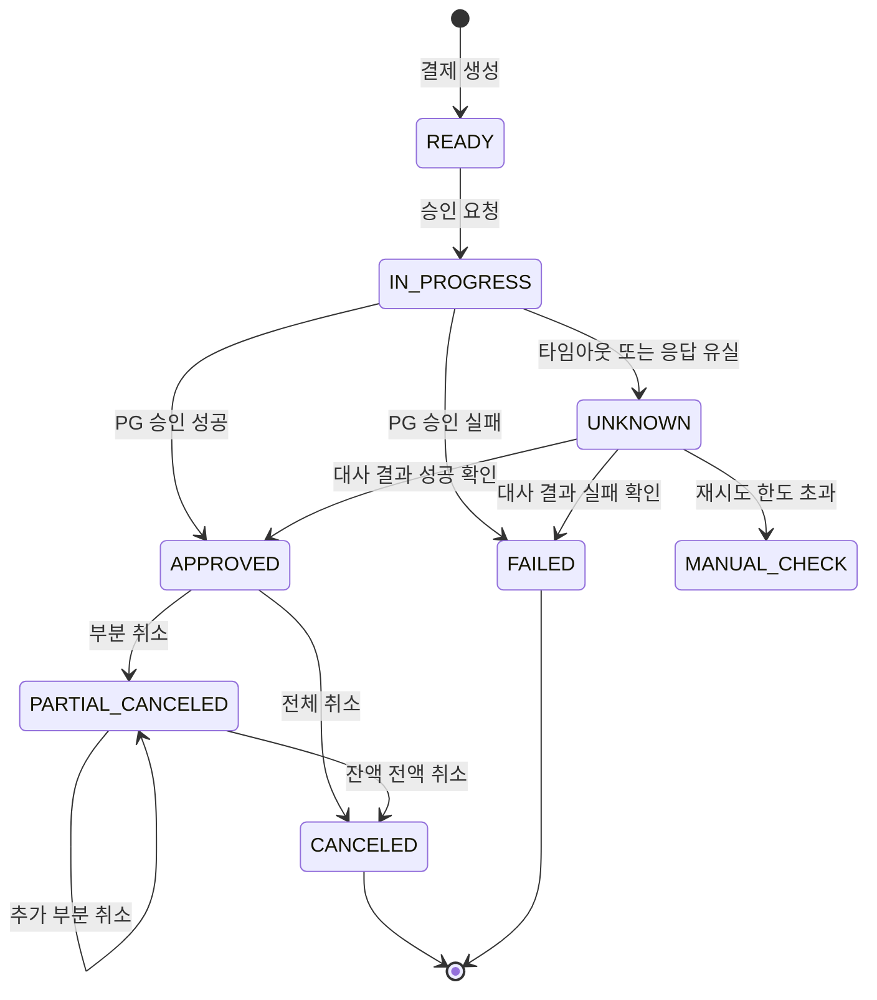

# payment-api

결제 승인과 취소를 처리하는 API입니다. 외부 PG 응답이 유실되는 상황에서 **거래 상태를 잃지 않는 것**에 초점을 맞췄습니다.

---

## 왜 이 주제인가

결제 시스템에서 가장 다루기 까다로운 것은 성공도 실패도 아닌 상태입니다. 승인 요청을 보냈는데 타임아웃이 났을 때, 그 거래가 승인된 것인지 아닌지 알 수 없습니다. 이때 실패로 처리하면 실제로는 돈이 빠져나간 거래를 실패로 알리게 됩니다.

이 프로젝트는 그 구간을 어떻게 다룰지에 대한 답을 코드로 정리한 것입니다.

---

## 실행

```bash
docker compose up -d      # MySQL
./gradlew bootRun
```

API 문서: http://localhost:8080/swagger-ui.html

---

## 결제 상태
### 초기 설계안


- 이 그림은 최종 설계이고, 현재 코드는 PENDING/APPROVED/PARTIAL_CANCELED/CANCELED/FAILED 5개만 구현되어 있습니다.
- [간소화 설계안](docs/state-machine.md)에는 UNKNOWN과 MANUAL_CHECK가 없는 상태 다이어그램이 있습니다.


**규칙**

- UNKNOWN 상태에서는 취소 요청을 받지 않습니다. 확정되지 않은 거래를 취소할 수 없습니다.
- 부분 취소의 누적 금액은 승인 금액을 넘을 수 없습니다.
- 모든 상태 전이는 이력 테이블에 기록합니다.

---

## 설계 판단

이 프로젝트에서 정한 것들과 그 근거입니다.

### 1. 멱등성 키는 클라이언트가 생성한다

서버가 키를 만들면 클라이언트가 재시도할 때 같은 키를 보낼 수 없습니다. 재시도 시 요청의 동일성이 보장되어야 하므로 키 생성 주체는 클라이언트입니다.

`Idempotency-Key` 헤더를 필수로 받습니다.

### 2. 같은 키에 다른 본문이 오면 409 Conflict

키와 함께 요청 본문의 해시를 저장합니다. 같은 키로 다른 결제를 밀어 넣는 것을 막기 위해서입니다.

같은 키에 같은 본문이면 저장된 응답을 그대로 반환하고 재처리하지 않습니다.

### 3. 처리 중인 키에 요청이 오면 409 Conflict

202 Accepted도 후보였습니다. 그러나 202는 "요청을 접수했다"는 의미라 클라이언트가 새 요청이 생성된 것으로 오해할 수 있습니다. 이미 처리 중이라는 사실을 명확히 알리기 위해 409를 선택했습니다.

### 4. 타임아웃은 실패가 아니라 UNKNOWN이다

**이 프로젝트에서 가장 중요한 판단입니다.**

PG 응답이 없다는 것은 요청이 도달하지 않았다는 뜻이 아닙니다. 승인이 이미 처리되었는데 응답만 유실되었을 수 있습니다. 이를 실패로 처리하면 실제로는 승인된 거래를 실패로 알리게 되고, 고객은 결제되지 않았다고 알면서 돈이 빠져나갑니다.

따라서 타임아웃 시 상태를 UNKNOWN으로 두고, 사용자에게는 성공도 실패도 아닌 **처리 중**으로 응답합니다. 확정은 대사로 합니다.

### 5. 대사 주기는 1분

미결 거래를 오래 두면 고객이 결과를 알 수 없는 시간이 길어집니다. 반대로 주기가 너무 짧으면 PG 조회 API에 불필요한 부하를 줍니다.

1분은 사용자가 결과를 기다릴 수 있는 시간과 외부 시스템 부하 사이에서 정한 값입니다.

### 6. 재시도는 10회까지, 초과하면 수동 확인 대상으로 분리한다

대사로도 확정되지 않는 거래가 있습니다. PG 쪽 데이터가 아직 정리되지 않았거나 실제로 문제가 있는 경우입니다.

무한 재시도는 외부 시스템에 부담이 되고 문제를 감춥니다. 10회를 넘기면 `MANUAL_CHECK` 상태로 분리해 사람이 확인하도록 합니다.

### 7. 재시도는 조회에만 허용한다

승인 요청을 그대로 재시도하면 이중 결제가 발생할 수 있습니다. 조회는 상태를 바꾸지 않으므로 재시도해도 안전합니다.

승인 요청을 재시도하려면 PG 쪽에서도 멱등성이 보장되어야 하는데, 그것은 이 프로젝트의 통제 범위 밖입니다.

---

## 실패 시나리오와 대응

| 상황 | 결제 상태 | 사용자 응답 | 후속 처리 |
|---|---|---|---|
| PG가 승인 거절 | FAILED | 실패 | 없음 |
| PG 타임아웃 | UNKNOWN | 처리 중 | 대사로 확정 |
| PG 응답 유실 | UNKNOWN | 처리 중 | 대사로 확정 |
| 대사 10회 실패 | MANUAL_CHECK | 처리 중 | 운영자 확인 |
| 같은 요청 재전송 | 변화 없음 | 최초 응답 재사용 | 없음 |
| 취소 금액이 잔액 초과 | 변화 없음 | 400 | 없음 |
| 동시 취소 요청 | 하나만 반영 | 나머지는 400 또는 409 | 없음 |

---

## 테스트

| 테스트 | 검증 대상 |
|---|---|
| 상태 전이 규칙 | 허용되지 않은 전이가 차단되는가 |
| 부분 취소 금액 누적 | 승인액을 초과하는 취소가 거부되는가 |
| **동시 취소 요청** | 스레드 여러 개가 동시에 취소해도 누적 금액이 승인액을 넘지 않는가 |
| 멱등성 중복 요청 | 같은 키로 두 번 요청해도 승인이 한 번만 일어나는가 |
| 멱등성 본문 불일치 | 같은 키에 다른 본문이 오면 409를 반환하는가 |
| 타임아웃 처리 | PG 타임아웃 시 FAILED가 아닌 UNKNOWN이 되는가 |
| 대사 확정 | UNKNOWN 건이 조회 결과로 확정되는가 |

---

## 만들지 않은 것

무엇을 뺐는지와 그 이유입니다. 범위를 정하기 위해 의도적으로 제외했습니다.

| 항목 | 이유 |
|---|---|
| 인증과 인가 | 결제 도메인에 집중. 헤더로 가맹점 ID만 받습니다 |
| 프론트엔드 | API만 다룹니다 |
| 실제 PG 연동 | 시뮬레이터로 타임아웃과 실패를 만들 수 있으면 충분합니다 |
| 정산 | 대사까지만. 정산은 범위가 다른 문제입니다 |
| 서비스 분리 | 단일 애플리케이션. 나눌 이유가 없습니다 |
| Spring Batch | 대사 대상 건수가 많지 않아 스케줄러와 단순 조회로 충분합니다. 청크 처리와 재시작이 필요해지면 그때 도입하는 것이 맞다고 판단했습니다 |
| 서킷브레이커 | 타임아웃과 UNKNOWN 처리로 1차 격리가 되므로 이후 과제로 둡니다 |

---

## 기술

Java 21, Spring Boot 3.x, Spring Data JPA, MySQL 8, Docker Compose, JUnit 5

---

## 진행 상황

- [ ] 결제 도메인과 상태 전이 규칙
- [ ] 승인, 취소, 조회 API
- [ ] 멱등성 처리
- [ ] 동시성 제어와 동시성 테스트
- [ ] PG 시뮬레이터
- [ ] UNKNOWN 확정 스케줄러
