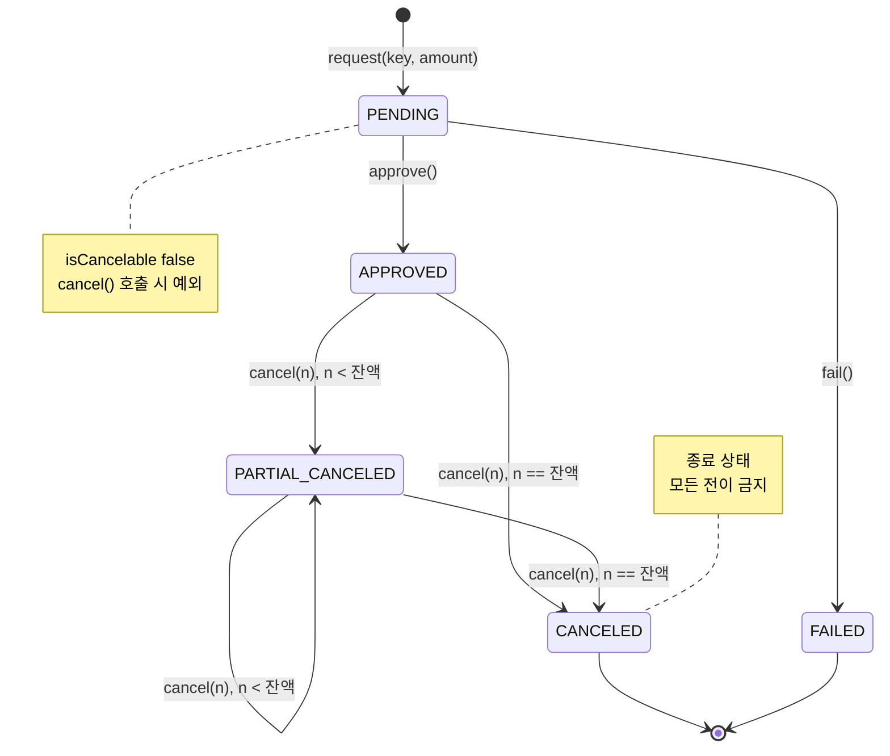

# 결제 상태 전이

현재 코드(`PaymentStatus`, `Payment`)가 실제로 허용하는 전이만 담았습니다.
`README.md` 의 "앞으로 만들 것"에 있는 `UNKNOWN`, `MANUAL_CHECK` 는 아직 구현되지 않았습니다.

## 상태 다이어그램



## 상태

| 상태 | 의미 | 취소 가능 |
|---|---|---|
| `PENDING` | 결제 요청을 받아 승인을 기다리는 상태 | 불가 |
| `APPROVED` | 승인 완료 | 가능 |
| `PARTIAL_CANCELED` | 일부만 취소됨. 잔액에 대해 추가 취소 가능 | 가능 |
| `CANCELED` | 전액 취소됨. 종료 상태 | 불가 |
| `FAILED` | 승인 실패. 종료 상태 | 불가 |

## 규칙

- 결제 금액은 0보다 커야 한다
- 취소 금액은 0보다 커야 하고, 취소 가능 금액(`amount - canceledAmount`)을 넘을 수 없다
- 누적 취소액이 결제 금액에 도달하면 `CANCELED`, 그렇지 않으면 `PARTIAL_CANCELED`
- 취소 요청마다 `PaymentCancel` 이력이 한 건 생긴다
- 금액은 원 단위 `long`

## 전이와 테스트 대응

다이어그램의 화살표 하나가 테스트 하나입니다.

| 전이 | 테스트 |
|---|---|
| `PENDING → APPROVED` | PENDING 상태에서 승인하면 APPROVED 가 된다 |
| `PENDING → FAILED` | PENDING 상태에서 실패 처리하면 FAILED 가 된다 |
| `APPROVED → CANCELED` | APPROVED 상태에서 전액 취소하면 CANCELED 가 된다 |
| `APPROVED → PARTIAL_CANCELED` | APPROVED 상태에서 일부 취소하면 PARTIAL_CANCELED 가 된다 |
| `PARTIAL_CANCELED → PARTIAL_CANCELED` | 부분 취소를 두 번 하면 PARTIAL_CANCELED 를 유지한다 |
| `PARTIAL_CANCELED → CANCELED` | PARTIAL_CANCELED 상태에서 남은 전액을 취소하면 CANCELED 가 된다 |

**다이어그램에 없는 화살표는 전부 금지**이며, 각각이 예외 테스트가 됩니다.

| 금지된 전이 | 테스트 | 예외 |
|---|---|---|
| `APPROVED → APPROVED` | 이미 승인된 결제를 다시 승인할 수 없다 | `InvalidPaymentStateException` |
| `APPROVED → FAILED` | 승인된 결제를 실패 처리할 수 없다 | `InvalidPaymentStateException` |
| `PENDING → CANCELED` | PENDING 상태에서는 취소할 수 없다 | `InvalidPaymentStateException` |
| `CANCELED → *` | CANCELED 이후에는 아무 전이도 할 수 없다 | `InvalidPaymentStateException` |
| `FAILED → *` | FAILED 이후에는 아무 전이도 할 수 없다 | `InvalidPaymentStateException` |

`PENDING` 에서의 취소만 예외가 나오는 경로가 다릅니다.
`cancel()` 이 `transitionTo()` 에 닿기 전에 `isCancelable()` 검사에서 먼저 던지므로 메시지가 다릅니다.
타입만 검증하면 두 경로를 구분하지 못하니 메시지까지 확인합니다.

```java
assertThatThrownBy(() -> payment.cancel(1_000L))
        .isInstanceOf(InvalidPaymentStateException.class)
        .hasMessageContaining("취소할 수 없는 상태");
```

## 금액 경계

경계는 통과하는 쪽과 실패하는 쪽을 쌍으로 확인합니다.

| 통과 | 실패 |
|---|---|
| 취소 1원 | 취소 0원 |
| 잔액과 정확히 같은 금액 취소 | 잔액보다 1원 많은 금액 취소 |
